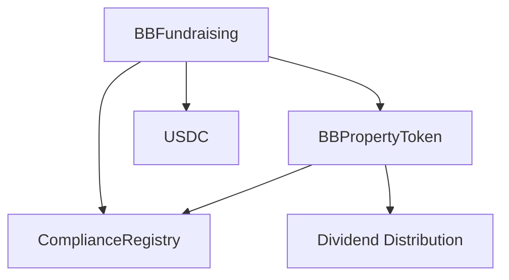

# BBLong Property Token Platform

A decentralized platform for tokenizing real estate properties with built-in compliance, fundraising, and dividend distribution capabilities.

## Overview

The platform consists of four main components:

1. **BBPropertyToken**: ERC20 token representing ownership in a property with dividend distribution capabilities
2. **BBFundraising**: Manages the fundraising process for property tokens using USDC
3. **ComplianceRegistry**: Handles KYC/AML compliance for token holders
4. **BBCoin**: Utility token for the platform (optional)

## Key Features

- **Compliant Token Transfers**: All transfers are checked against a compliance registry
- **Flexible Fundraising**:
  - USDC-based investments
  - Whitelist support for early investors
  - Configurable soft and hard caps
  - Automatic token distribution
- **Dividend Distribution**:
  - Snapshot-based dividend calculations
  - Fair distribution based on token holdings
  - ETH dividend payments
- **Access Control**:
  - Role-based permissions
  - Admin controls for critical functions
  - Compliance officer role for KYC/AML

## Contract Architecture



## Getting Started

### Prerequisites

- Node.js v14+ and npm
- Hardhat
- OpenZeppelin Contracts

### Installation

```bash
# Clone the repository
git clone https://github.com/yourusername/bblong-bbcoin-contract.git

# Install dependencies
npm install
```

### Configuration

1. Create a `.env` file:
```env
PRIVATE_KEY=your_private_key
INFURA_API_KEY=your_infura_api_key
ETHERSCAN_API_KEY=your_etherscan_api_key
```

2. Configure the network in `hardhat.config.js`

### Deployment

```bash
# Deploy all contracts
npx hardhat run scripts/deploy-fundraising.js --network <network_name>
```

## Usage Guide

### For Property Owners

1. Deploy the fundraising contract with your USDC parameters
2. Set the whitelist for early investors
3. Monitor the fundraising progress
4. Finalize the fundraising when complete
5. Distribute dividends using the property token contract

### For Investors

1. Get approved in the compliance registry
2. Approve USDC spending for the fundraising contract
3. Invest during the fundraising period
4. Claim property tokens after successful fundraising
5. Claim dividends when distributed

### For Administrators

1. Manage compliance registry
2. Update whitelists
3. Control fundraising parameters
4. Oversee dividend distributions

## Contract Interactions

### Investing in a Property

```javascript
// Approve USDC spending
await usdc.approve(fundraisingAddress, amount);

// Make investment
await bbFundraising.invest(amount);
```

### Claiming Tokens

```javascript
// After successful fundraising
await bbFundraising.claimTokens();
```

### Distributing Dividends

```javascript
// Create new dividend distribution
await bbPropertyToken.createDividendDistribution({ value: ethers.parseEther("1.0") });
```

## Security Considerations

- All contracts use OpenZeppelin's security features
- Reentrancy protection on state-changing functions
- Role-based access control
- Compliance checks on all transfers
- Safe math operations
- Protected dividend distributions

## Testing

```bash
# Run all tests
npx hardhat test

# Run specific test file
npx hardhat test test/BBFundraising.test.js
```

## Auditing

The contracts have been designed with security best practices but should undergo a professional audit before mainnet deployment.

## License

ISC

## Contributing

1. Fork the repository
2. Create your feature branch
3. Commit your changes
4. Push to the branch
5. Create a new Pull Request
